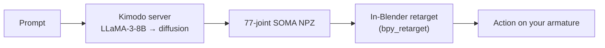

# Blender Kimodo Motion

> [中文说明](README_CN.md) | English

A Blender add-on that brings **NVIDIA Kimodo** text-to-motion generation into Blender. Type a
prompt, select a character, and receive an animated Action — generated locally on your GPU and
retargeted onto your rig.

  -green) 

> Based on **[Xingxun7777/blender-kimodo-motion](https://github.com/Xingxun7777/blender-kimodo-motion)**
> by Xingxun, extended with macOS / Apple Silicon (Metal/MPS) support, in-Blender retargeting, and
> Blender Extension packaging. See [Credits & licensing](#credits--licensing).

---

## Overview

1. Select any humanoid armature in Blender (Mixamo, VRoid, MMD, or a custom rig).
2. Enter a prompt in English or Chinese.
3. The add-on calls a local Kimodo inference server, generates a 77-joint SOMA motion, and
   retargets it onto your armature inside Blender.
4. You get one or more Action data-blocks named `Kimodo_<prompt>_sNN`, ready for the NLA editor.

Everything runs locally on your GPU — no cloud and no API keys (aside from the optional
prompt-translation API).

## Compatibility

| | Windows | macOS | Linux x64 |
|---|---|---|---|
| Accelerator | NVIDIA RTX 20/30/40/50 (CUDA) | Apple Silicon (Metal / MPS) | NVIDIA RTX (CUDA) |
| Blender | 5.0+ | 5.0+ | 5.0+ |
| Runtime Python | 3.10 – 3.13 | 3.10 – 3.13 | 3.10 – 3.13 |
| Memory | 16 GB+ VRAM | 32 GB+ unified recommended | 16 GB+ VRAM |
| Disk | ~25–50 GB | ~25–50 GB | ~25–50 GB |
| Status | Stable | Validated | Manual install |

Retargeting runs inside Blender on every platform, so the Autodesk FBX SDK is no longer required.
Linux x64/CUDA uses the same server and in-Blender retarget path, but there is currently **no
one-click runtime installer/package for Linux**; use the manual install steps in `INSTALL.md` /
`INSTALL_EN.md`.

## Install & run

1. Enable the extension: `Preferences > Add-ons > Install from Disk…` → `kimodo_motion.zip`.
2. Install the runtime:
   - Windows / macOS: **N-panel > Kimodo > Runtime Install > One-click install runtime**
     (Python venv + PyTorch + kimodo + the inference server).
   - Linux x64/CUDA: no one-click installer yet; follow the manual install section in
     `INSTALL.md` / `INSTALL_EN.md`.
3. Set the add-on's **venv path** preference to where the runtime was installed.

The runtime installs Kimodo from **[atticus-lv/kimodo](https://github.com/atticus-lv/kimodo)**, a
fork with the MPS/macOS and post-processing compatibility work used by this add-on. The text
encoder needs **Meta-Llama-3-8B-Instruct** (~16 GB, gated by Meta); an ungated mirror is also
supported. Full steps, options, and the model setup are in
**[INSTALL.md](./INSTALL.md)** (中文) / **[INSTALL_EN.md](./INSTALL_EN.md)** (English).

## Usage

1. Import a humanoid rig (Mixamo X Bot, a VRoid character, an MMD PMX, etc.).
2. Select its armature in Object Mode; the N-panel shows the detected target and preset.
3. Enter a prompt, duration (2–10 s), and number of variants (1–8).
4. Click **Generate and apply to selected armature**.
5. Switch between variants in the **Generated Actions** sub-panel.

Prompt examples:

- `A person walks forward and waves the right hand.`
- `优雅地跳舞` — auto-translated to English when translation mode is on.
- `The character performs a backflip and lands in a fighting stance.`

## How it works

Inference runs in a dedicated Python venv. Retargeting is performed directly on the armature with
`mathutils` (a validated rest-delta rotation transfer, SOMA Y-up → Blender Z-up), so no FBX
round-trip is involved.

## Credits & licensing

This project began as a fork of
**[Xingxun7777/blender-kimodo-motion](https://github.com/Xingxun7777/blender-kimodo-motion)**
by Xingxun (originally MIT-licensed) and was extended with macOS / Apple Silicon (Metal/MPS)
support, in-Blender retargeting, a project-contained runtime, and Blender Extension packaging. It
is redistributed under GPL-3.0-or-later, which is compatible with the original MIT terms; the
original copyright and authorship are retained.

**Authors**

- **Xingxun** — original add-on — [github.com/Xingxun7777](https://github.com/Xingxun7777)
- **Atticus** — macOS / Metal port, in-Blender retarget, Extension packaging — [github.com/atticus-lv](https://github.com/atticus-lv)

**Acknowledgements**

- [NVIDIA Toronto AI Lab](https://github.com/nv-tlabs) — Kimodo model and training code
- [jtydhr88/ComfyUI-Kimodo](https://github.com/jtydhr88/ComfyUI-Kimodo) — FBX retarget logic referenced during development
- McGill-NLP — LLM2Vec text-encoder adapters; Meta AI — Llama-3-8B-Instruct (gated)

**Component licenses**

| Component | License |
|-----------|---------|
| This add-on (`kimodo_motion/*`) | GPL-3.0-or-later |
| Vendored retarget reference (`vendor/kimodo_retarget/*`) | Apache-2.0 ([ComfyUI-Kimodo](https://github.com/jtydhr88/ComfyUI-Kimodo)) |
| [atticus-lv/kimodo](https://github.com/atticus-lv/kimodo), based on NVIDIA [kimodo](https://github.com/nv-tlabs/kimodo) | Apache-2.0 |
| Kimodo-SOMA-RP-v1 weights | NVIDIA Open Model License |
| Meta-Llama-3-8B-Instruct | Meta Llama-3 Community License (gated) |
| PyTorch | BSD-3-Clause |

Model weights and gated content are never bundled — each machine fetches them from their original
sources. The add-on is licensed under **GPL-3.0-or-later**; see [LICENSE](./LICENSE).
