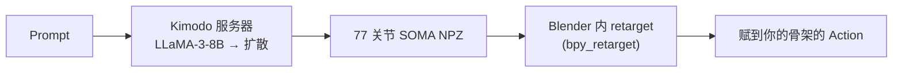

# Blender Kimodo Motion

> 中文说明 | [English](README.md)

将 **NVIDIA Kimodo** 文本生成动作能力带入 Blender 的插件。输入一句 prompt、选中角色骨架，即可在
本地 GPU 上生成动作并 retarget 到你的骨架，得到可直接使用的 Action。

  -green) 

> 基于 **[Xingxun7777/blender-kimodo-motion](https://github.com/Xingxun7777/blender-kimodo-motion)**
> （作者 Xingxun），新增 macOS / Apple Silicon（Metal/MPS）支持、Blender 内 retarget、扩展打包。
> 详见 [来源与协议](#来源与协议)。

---

## 概览

1. 选中场景里任意人形骨架（Mixamo / VRoid / MMD / 自定义）。
2. 输入中文或英文 prompt。
3. 插件调用本地 Kimodo 推理服务器，生成 77 关节 SOMA 动作，并在 Blender 内 retarget 到你的骨架。
4. 得到一个或多个命名为 `Kimodo_<prompt>_sNN` 的 Action，可直接拖入 NLA。

全程本地 GPU 推理，不联网（除可选的 prompt 翻译 API 外）。

## 兼容性

| | Windows | macOS | Linux x64 |
|---|---|---|---|
| 加速器 | NVIDIA RTX 20/30/40/50（CUDA） | Apple Silicon（Metal / MPS） | NVIDIA RTX（CUDA） |
| Blender | 5.0+ | 5.0+ | 5.0+ |
| 运行时 Python | 3.10 – 3.13 | 3.10 – 3.13 | 3.10 – 3.13 |
| 显存/内存 | 16 GB+ 显存 | 建议 32 GB+ 统一内存 | 16 GB+ 显存 |
| 磁盘 | ~25–50 GB | ~25–50 GB | ~25–50 GB |
| 状态 | 稳定 | 已验证 | 手工安装 |

所有平台的 retarget 都在 Blender 内完成，因此**不再需要 Autodesk FBX SDK**。
Linux x64/CUDA 复用同一套服务器与 Blender 内 retarget 链路，但目前**没有 Linux 一键运行时安装包**；
请按 `INSTALL.md` / `INSTALL_EN.md` 的手工安装步骤配置。

## 安装与运行

1. 启用扩展：`偏好设置 > 插件 > 从磁盘安装…` → `kimodo_motion.zip`。
2. 安装运行时：
   - Windows / macOS：**N 面板 > Kimodo > Runtime 安装 > 一键安装 Runtime**
     （Python venv + PyTorch + kimodo + 推理服务器）。
   - Linux x64/CUDA：暂时没有一键安装器，请按 `INSTALL.md` / `INSTALL_EN.md` 的手工安装步骤配置。
3. 把插件偏好里的 **venv 路径**设为运行时实际安装的位置。

运行时默认安装 **[atticus-lv/kimodo](https://github.com/atticus-lv/kimodo)**，这是本插件使用的
Kimodo fork，包含 MPS/macOS 与后处理兼容相关改动。文本编码器需要 **Meta-Llama-3-8B-Instruct**
（约 16 GB，Meta 门控）；也支持非门控镜像。完整步骤、参数与模型设置见
**[INSTALL.md](./INSTALL.md)**（中文）/ **[INSTALL_EN.md](./INSTALL_EN.md)**（英文）。

## 使用

1. 导入任意人形 rig（Mixamo X Bot、VRoid 角色、MMD PMX 等）。
2. Object 模式选中其 Armature，N 面板会显示识别到的目标与预设。
3. 填写 prompt、时长（2–10 秒）、变体数（1–8）。
4. 点 **生成并应用到选中骨架**。
5. 在 **已生成的 Action** 子面板切换不同变体。

Prompt 示例：

- `A person walks forward and waves the right hand.`
- `优雅地跳舞` —— 开启翻译模式时自动 zh→en。
- `角色做一个后空翻并落地进入战斗姿态`。

## 工作原理

推理跑在独立 Python venv 里。Retarget 直接用 `mathutils` 在骨架上完成（经验证的 rest-delta 旋转
传递，SOMA Y-up → Blender Z-up），无需 FBX 往返。

## 来源与协议

本项目源自 **[Xingxun7777/blender-kimodo-motion](https://github.com/Xingxun7777/blender-kimodo-motion)**
（作者 Xingxun，原 MIT 协议）的 fork，在此基础上新增 macOS / Apple Silicon（Metal/MPS）支持、
Blender 内 retarget、项目内自包含运行时，并打包为 Blender 扩展。本仓库以 GPL-3.0-or-later 再分发
（与原 MIT 条款兼容），保留原始版权与署名。

**作者**

- **Xingxun** —— 原始插件 —— [github.com/Xingxun7777](https://github.com/Xingxun7777)
- **Atticus** —— macOS / Metal 移植、Blender 内 retarget、扩展打包 —— [github.com/atticus-lv](https://github.com/atticus-lv)

**致谢**

- [NVIDIA Toronto AI Lab](https://github.com/nv-tlabs) —— Kimodo 模型与训练代码
- [jtydhr88/ComfyUI-Kimodo](https://github.com/jtydhr88/ComfyUI-Kimodo) —— 开发期参考的 FBX retarget 逻辑
- McGill-NLP —— LLM2Vec 文本编码器 adapter；Meta AI —— Llama-3-8B-Instruct（门控）

**组件许可**

| 组件 | 协议 |
|------|------|
| 插件本身（`kimodo_motion/*`） | GPL-3.0-or-later |
| Vendored retarget 参考（`vendor/kimodo_retarget/*`） | Apache-2.0（[ComfyUI-Kimodo](https://github.com/jtydhr88/ComfyUI-Kimodo)） |
| [atticus-lv/kimodo](https://github.com/atticus-lv/kimodo)，基于 NVIDIA [kimodo](https://github.com/nv-tlabs/kimodo) | Apache-2.0 |
| Kimodo-SOMA-RP-v1 权重 | NVIDIA Open Model License |
| Meta-Llama-3-8B-Instruct | Meta Llama-3 Community License（门控） |
| PyTorch | BSD-3-Clause |

模型权重与任何 gated content 永不打包——每台机器从原始源拉取。插件以 **GPL-3.0-or-later** 授权，见 [LICENSE](./LICENSE)。
